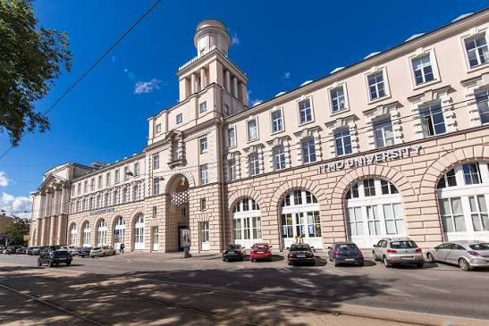
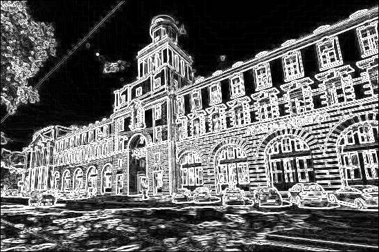
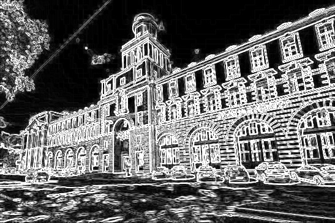

# Лабораторная работа №1 Солодовников Данила Дмитриевич

## Теория

Основная идея оператора Собеля — оценить скорость изменения интенсивности пикселей, то есть яркости пикселей по всему изображению.

На границе между объектами или областями изображения обычно происходит резкое изменение яркости пикселей. Поэтому величина производной в таких местах обычно получается достаточно большой.

Если найти участки изображения, где производная имеет большое значение, можно определить, где находятся границы и контуры объектов.

Для обнаружения краёв с помощью оператора Собеля изображение обычно преобразуется в один канал, то есть в оттенки серого.

### Ядра Собеля

Для вычисления изменения яркости оператор Собеля использует два свёрточных ядра.

$G_x$ — для определения изменения яркости по горизонтали:

$$
G_x =
\begin{bmatrix}
-1 & 0 & 1 \\
-2 & 0 & 2 \\
-1 & 0 & 1
\end{bmatrix}
$$

$G_y$ — для определения изменения яркости по вертикали:

$$
G_y =
\begin{bmatrix}
-1 & -2 & -1 \\
0 & 0 & 0 \\
1 & 2 & 1
\end{bmatrix}
$$

Каждое ядро накладывается на область изображения размером $3 \times 3$.
Значения яркости пикселей умножаются на соответствующие коэффициенты ядра, после чего результаты складываются.

Полученные значения $G_x$ и $G_y$ являются двумя составляющими градиента и показывают изменение яркости по горизонтали и вертикали.

### Магнитуда градиента

Чтобы определить общую силу изменения яркости независимо от направления, вычисляется магнитуда градиента:

$$
G = \sqrt{G_x^2 + G_y^2}
$$

Чем больше магнитуда градиента, тем сильнее перепад яркости и тем вероятнее, что в этой точке находится граница объекта.

### Формирование результирующего изображения

После вычисления магнитуды для каждого пикселя полученное значение используется как яркость соответствующего пикселя результирующего изображения.

Если магнитуда мала, пиксель будет тёмным, так как существенного изменения яркости в этой области нет.

Если магнитуда велика, пиксель будет светлым, что указывает на возможную границу объекта.

Таким образом, после обработки всех пикселей формируется новое изображение, на котором границы объектов выделяются светлыми линиями на тёмном фоне.

## Описание разработанной системы

Программа реализует оператор Собеля двумя способами: нативно на Python и с использованием библиотеки OpenCV.

### Нативная реализация

В нативной версии библиотека Pillow используется только для загрузки, преобразования и сохранения изображения.

Алгоритм выполняется следующим образом:

1. Загружается исходное изображение.
2. Изображение преобразуется в оттенки серого.
3. Создаётся новое изображение для результата.
4. Выполняется обход всех пикселей, кроме граничных.
5. Для каждого пикселя рассматривается область $3 \times 3$.
6. Значения яркости умножаются на коэффициенты ядер $G_x$ и $G_y$.
7. Вычисляется магнитуда градиента.
8. Полученное значение записывается в результирующее изображение.
9. Результат сохраняется в файл.

### Библиотечная реализация

В библиотечной версии используется библиотека OpenCV.

Исходное изображение загружается сразу в оттенках серого. Затем функция `cv2.Sobel()` дважды применяется к изображению: первый раз для вычисления изменения яркости по горизонтали, второй раз — по вертикали.

В результате получаются две составляющие градиента: $G_x$ и $G_y$.

После этого функция `cv2.magnitude()` для каждого пикселя вычисляет магнитуду градиента:

$$
G = \sqrt{G_x^2 + G_y^2}
$$

Полученное значение показывает силу изменения яркости в данной точке изображения. Чем оно больше, тем вероятнее наличие границы объекта.

В отличие от нативной реализации, в библиотечной версии обход пикселей, применение ядер Собеля и вычисление свёртки выполняются внутри функций OpenCV.

### Измерение времени

Для сравнения производительности двух реализаций используется функция `time.perf_counter()`.

## Результаты работы

### Исходное изображение



### Нативная реализация

```python
from PIL import Image
import time

start = time.perf_counter()
image = Image.open("image.jpeg").convert("L")
width, height = image.size
pixels = image.load()

G_x = [ [-1, 0, 1], [-2, 0, 2],[-1, 0, 1]]
G_y = [[-1, -2, -1],[0, 0, 0],[1, 2, 1]]

result = Image.new("L", (width, height))
result_pixels = result.load()

for y in range(1, height - 1):
    for x in range(1, width - 1):
        gradient_x = 0
        gradient_y = 0
        for kx in range(-1, 2):
            for ky in range(-1, 2):
                pixel = pixels[x + kx, y + ky]
                gradient_x += pixel * G_x[ky + 1][kx + 1]
                gradient_y += pixel * G_y[ky + 1][kx + 1]
        G = (gradient_x ** 2 + gradient_y ** 2) ** 0.5
        if G > 255:
            G = 255
        result_pixels[x, y] = (int)G

result.save("result.jpeg")
end = time.perf_counter()
print("Нативная версия:", end - start, "секунд")
```

**Результат выполнения программы:**

Время выполнения нативной реализации:

```text
Нативная версия: 1.0975100420000001 секунд
```



### Реализация OpenCV

```python
import cv2
import time

start = time.perf_counter()
image = cv2.imread("image.jpeg", cv2.IMREAD_GRAYSCALE)
sobel_x = cv2.Sobel(image, cv2.CV_64F, 1, 0)
sobel_y = cv2.Sobel(image, cv2.CV_64F, 0, 1)
result = cv2.magnitude(sobel_x, sobel_y)
result = cv2.convertScaleAbs(result)
cv2.imwrite("result_opencv.jpeg", result)
end = time.perf_counter()
print("OpenCV:", end - start, "секунд")
```

**Результат выполнения программы:**

Время выполнения OpenCV реализации:

```text
OpenCV: 0.01994600000000002 секунд
```



## Вывод

В ходе работы оператор Собеля был реализован двумя способами: нативно на Python и с использованием OpenCV. Обе реализации позволяют выделять границы объектов по резким изменениям яркости. Нативная версия помогает понять принцип работы алгоритма, а библиотечная является более компактной и быстрой.

## Источники

1. [Edge detection in images: how to derive the Sobel operator](https://nrsyed.com/2018/02/18/edge-detection-in-images-how-to-derive-the-sobel-operator/)

2. [Оператор Собеля](https://iandreev.wordpress.com/2010/06/22/sobel/)

3. [Видео по оператору Собеля](https://www.youtube.com/watch?v=L6idh6r3yls)
